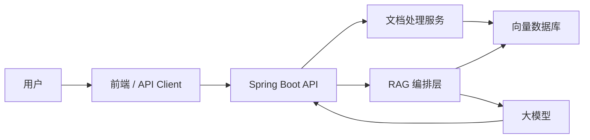
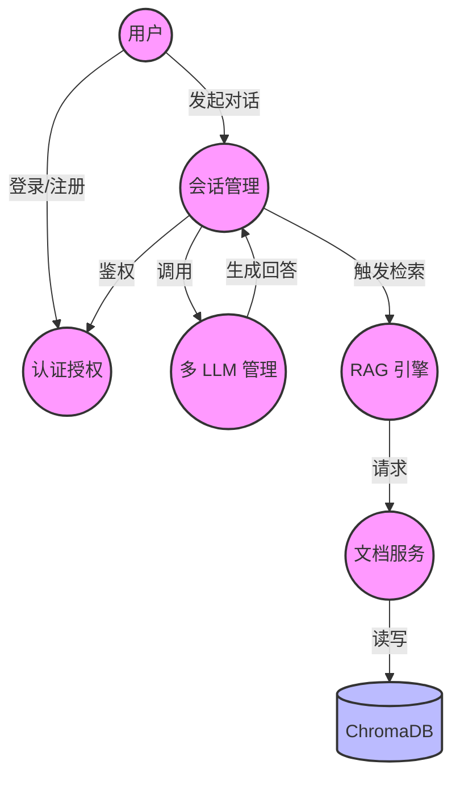

# 智迁云枢 · 架构设计文档

本文档详细描述了「智迁云枢 · Spring Boot RAG 多 LLM 智能对话平台」的系统架构、技术选型及核心模块交互流程。

## 1. 系统架构图

系统采用前后端分离、微服务化架构。Java Spring Boot 作为主服务处理业务逻辑与大模型交互，Python FastAPI 作为微服务专注于文档处理与向量检索。

### 1.1 详细交互流程

1. **用户请求**：用户通过前端界面或 API 客户端发起对话请求。
2. **主服务接收**：Spring Boot API 接收请求，进行 JWT 鉴权、限流检查及会话管理。
3. **RAG 检索**：
   - Spring Boot 的 RAG 编排层将用户问题发送至 Python 文档处理服务。
   - Python 服务使用 BGE 模型对问题进行向量化，并在 ChromaDB 中进行语义搜索。
   - 同时使用 BM25 算法进行关键词搜索。
   - 将向量检索（权重 0.7）与 BM25 检索（权重 0.3）结果进行加权融合，返回 Top K 文档块。
4. **上下文组装**：Spring Boot 接收检索结果，将其与系统提示词、历史会话记录组装成完整的 Prompt。
5. **LLM 调用**：通过多 LLM 抽象层，调用指定的底层大模型（如 GLM、GPT、Claude 等）。
6. **流式响应**：大模型返回结果后，Spring Boot 通过 SSE 或 WebSocket 将结果流式推送给前端。

## 2. 技术选型说明

### 2.1 Java 主服务 (Spring Boot)
- **核心框架**：Spring Boot 4.0.5 + Java 17
- **安全体系**：Spring Security + JWT
- **持久层**：MyBatis
- **实时通信**：SSE + WebSocket
- **API 文档**：Swagger / SpringDoc

### 2.2 Python RAG 微服务
- **Web 框架**：FastAPI
- **向量数据库**：ChromaDB
- **检索算法**：BM25
- **嵌入模型**：sentence-transformers (BAAI/bge-small-zh-v1.5)

### 2.3 架构亮点
- **多 LLM 抽象层**：通过策略模式封装不同大模型的 API 差异，支持热切换 GLM / GPT / Claude / DeepSeek / Qwen。
- **混合检索机制**：结合稠密向量检索与稀疏检索（BM25），大幅提升 RAG 召回准确率。
- **纵深防御安全体系**：从网关限流、JWT 身份认证、接口权限校验到敏感词过滤。

## 3. 知识图谱可视化

以下是系统核心概念与模块的关联关系（Obsidian 风格 Graph View 概念图）：

