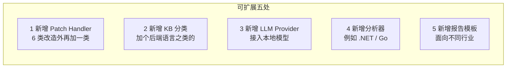
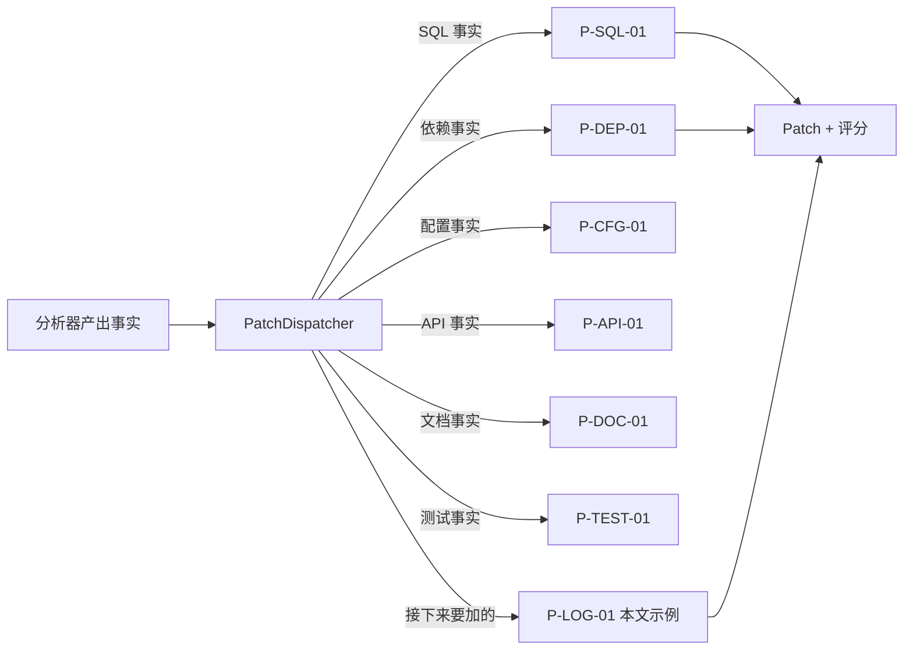

# 智迁云枢 · 扩展指南

> 这份文档用一个真实示例告诉你一件事: 智迁云枢不是个黑盒,它是一个可以在一小时内加上新能力的平台。

---

## 扩展点全图



本文只讲最高频的 1 · 新增 Patch Handler。其它四类在每节末尾给出入口。

---

## 背景 · Patch Handler 是啊



一个 Handler = 一类事实 → 一批 Patch + 评分。接口在 `IPatchHandler`。

---

## 5 步加完 P-LOG-01

### Step 1 · 认识接口（2 分钟）

```java
// zhiqian-backend/src/main/java/.../patch/IPatchHandler.java
public interface IPatchHandler {
    String code();                       // "P-LOG-01"
    boolean supports(AnalyzeFact fact);  // 能不能处理这条事实
    List<Patch> handle(AnalyzeFact fact, KbContext kb);
    PatchScore score(Patch p);           // 技术/风险/工量
}
```

### Step 2 · 写一个 Handler 骨架（5 分钟）

创建文件 `LogMigrationPatchHandler.java`：

```java
@Component
public class LogMigrationPatchHandler implements IPatchHandler {

    @Override
    public String code() { return "P-LOG-01"; }

    @Override
    public boolean supports(AnalyzeFact fact) {
        return fact.type() == FactType.DEPENDENCY
                && fact.groupId().equals("log4j");
    }

    @Override
    public List<Patch> handle(AnalyzeFact fact, KbContext kb) {
        Patch p = Patch.builder()
                .code("P-LOG-01")
                .target(fact.pomPath())
                .before(fact.snippet())
                .after("""
                    <dependency>
                        <groupId>ch.qos.logback</groupId>
                        <artifactId>logback-classic</artifactId>
                        <version>1.5.6</version>
                    </dependency>
                    """)
                .note("加上 slf4j-api,移除 log4j 传递依赖")
                .kbRefs(kb.lookup("log4j-to-logback"))
                .build();
        return List.of(p);
    }

    @Override
    public PatchScore score(Patch p) {
        return PatchScore.of(
                /* feasibility */ 9.0,
                /* risk        */ 2.0,
                /* effort_days */ 0.5
        );
    }
}
```

### Step 3 · 在规则库加 yaml（3 分钟）

`zhiqian-rag/kb/rules/log-migration.yaml`：

```yaml
- id: log4j-to-logback
  title: log4j 迁移到 logback
  applies_when:
    dependency.groupId: log4j
  steps:
    - 移除 log4j 依赖
    - 加入 ch.qos.logback:logback-classic
    - 加入 org.slf4j:slf4j-api
    - 转换 log4j.properties → logback.xml
  risks:
    - 自定义 Appender 需手动重写
  test:
    - 启动后验证日志输出无重复
```

### Step 4 · 写单测！10 分钟）

```java
class LogMigrationPatchHandlerTest {

    @Test void 能识别_log4j_依赖() {
        var fact = AnalyzeFact.dep("log4j", "log4j", "1.2.17");
        var h = new LogMigrationPatchHandler();
        assertTrue(h.supports(fact));
    }

    @Test void 应该产出_logback_依赖补丁() {
        var fact = AnalyzeFact.dep("log4j", "log4j", "1.2.17");
        var patches = new LogMigrationPatchHandler().handle(fact, kbStub());
        assertThat(patches).singleElement()
                .extracting(Patch::after)
                .asString().contains("logback-classic");
    }
}
```

### Step 5 · 跑一个带 log4j 的 Demo 项目验证

```bash
open demo/demo-legacy-log4j.zip
# 看报告中是否出现 P-LOG-01
```

看到 → 完成。一小时左右。

---

## PR 提交清单

- [ ] `IPatchHandler` 实现类
- [ ] 对应的 `kb/rules/*.yaml`
- [ ] 单测覆盖 `supports()` 和 `handle()`
- [ ] `CHANGELOG.md` 新增一行

---

## 其他四类扩展点入口

| 扩展点 | 入口文件 |
|------|----------|
| 新增 KB 分类 | `zhiqian-rag/kb/README.md` |
| 新增 LLM Provider | `zhiqian-backend/.../llm/LlmProvider.java` |
| 新增分析器 | `zhiqian-analyzer/README.md` |
| 新增报告模板 | `zhiqian-backend/.../report/templates/` |

---

## 贡献建议

1. 先从 Patch Handler 入手——带来的价値最直接。
2. 一个 PR 只加一个 Handler——保持可评审。
3. 规则 yaml 与 Java 代码一起提交——一起 review、一起回滚。
4. 可逆操作走 LLM 生成，不可逆操作只输出脚本——项目本能。