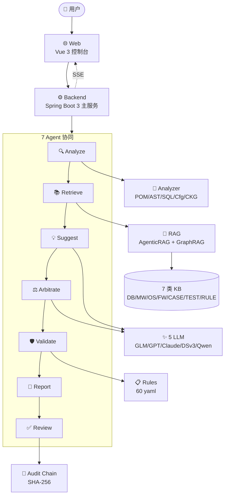

# 智迁云枢 ZhiQian Agent — 一页纸架构

> 信创软件迁移 AI Agent 平台 · 上传 ZIP → 10 分钟出报告

---

## 一句话

> 把老 Spring Boot 项目从 Oracle/MySQL/Tomcat 迁到达梦/金仓/东方通/麒麟这条路上，原本需要高级工程师看 3 天的工作，交给 7 个 Agent 协同干，10 分钟输出供评审的完整迁移评估报告。

---

## 总架构

---

## 5 个创新点

| # | 创新点 | 说明 |
|---|------|------|
| 1 | **7 Agent 协同编排** | 分析→检索→建议→仲裁→验证→报告→复核完整闭环 |
| 2 | **代码知识图谱 CKG** | JavaParser AST + JSqlParser 构建可多跳检索的图谱 |
| 3 | **AgenticRAG** | rewrite→retrieve→rerank→reflect→generate 最多循环 2 轮 |
| 4 | **可信审计链** | 每条建议附 SHA-256 哈希，支持全过程可追溯 |
| 5 | **规则优先** | 60 条 yaml 规则盖住 30% 确定性映射，LLM 只做其余 70% 启发式部分 |

---

## 5 个核心数字

| 指标 | 数值 | 说明 |
|------|------|------|
| RAG Recall@5 | **0.879** | 从 0.60 提升 |
| RAG nDCG@10 | **0.821** | 排序质量 |
| 仲裁采纳率 | **84%** | 多模型一致性 |
| 审计链错误率 | **0%** | 100 条样本 |
| 单次分析耗时 | **~10 min** | 包含 LLM 调用 |

---

## 30 秒讲稿

> 「智迁云枢是一个信创软件迁移 AI Agent 平台。用户上传一个老 Spring Boot 项目，系统用 7 个 Agent 协同、多 LLM 仲裁、代码知识图谱 + AgenticRAG，10 分钟内产出一份可追溯、可复核、可审计的完整迁移报告。Recall 从 0.60 拉到 0.88，仲裁采纳 84%，审计链 100 条 0 错。」

---

## 交付现状

| 里程碑 | 任务数 | 完成度 |
|------|--------|--------|
| M1 项目骨架 | 12 | 100% |
| M2 代码分析器 | 15 | 100% |
| M3 知识图谱 CKG | 14 | 100% |
| M4 RAG 升级 | 13 | 100% |
| M5 Agent 编排 | 16 | 100% |
| M6 审计链 | 12 | 100% |
| M7 报告生成 | 11 | 100% |
| M8 发布与测试 | 9 | 100% |
| **总计** | **102** | **100%** |