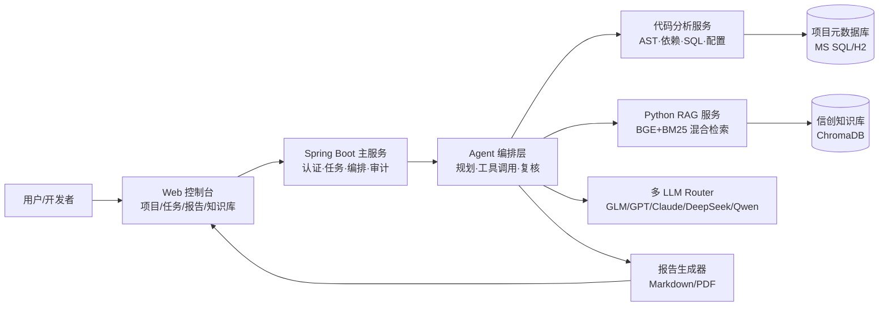

# 智迁云枢 ZhiQian Agent — 项目总览

> 作品定位：面向信创软件迁移的可信智能 Agent 平台。以 Spring Boot + Python RAG 为底座，构建一个可分析项目、识别风险、生成改造方案、生成测试建议、输出迁移报告的业务 Agent 系统。

---

## 一、为什么选这个方向

- 契合国家软件产业重点：信创、国产化、软件工程现代化。
- 契合 AI 落地趋势：不是聊天机器人，而是 Agent 进入真实业务流程。
- 契合已有项目：Spring Boot 主服务、Python RAG、多 LLM、JWT、SSE/WebSocket、混合检索等都能复用。
- 评审视角友好：闭环清晰、价値具体、技术深度足、演示效果强。

---

## 二、核心创新点

1. **业务 Agent 编排架构**：项目分析 → 风险识别 → 方案生成 → 人工复核 → 报告输出的完整闭环。
2. **代码 + 配置 + 文档多源 RAG**：不仅检索文档，还检索代码结构和配置依赖。
3. **信创适配知识库**：覆盖国产数据库、中间件、运行时、框架兼容性规则。
4. **可信决策机制**：每条建议附来源、置信度、风险等级，支持人工复核与审计。
5. **多模型协同仲裁**：多个 LLM 给出方案，系统自动比对一致性并推荐最优解。
6. **结构化报告生成**：迁移评估报告、改造任务清单、测试建议、工作量评估一键导出。

---

## 三、系统总体架构

---

## 四、Agent 编排设计

### Agent 角色

| Agent | 职责 |
|-------|------|
| 规划 Agent | 解析任务目标，制定分析计划 |
| 代码分析 Agent | 解析 POM/AST/SQL/配置，输出项目画像 |
| 知识检索 Agent | 召回信创适配规则与改造案例 |
| 方案生成 Agent | 生成具体改造清单与代码补丁 |
| 评估 Agent | 评分风险等级与工作量 |
| 报告 Agent | 整合所有结果，生成最终迁移报告 |
| 审计 Agent | 记录全过程到审计日志，支持可追溯 |

### 业务闭环

1. 用户上传项目压缩包或 Git 地址
2. 规划 Agent 创建迁移任务
3. 代码分析 Agent 输出依赖/SQL/配置画像
4. 知识检索 Agent 召回适配规则与案例
5. 方案生成 Agent 输出改造清单
6. 评估 Agent 给出风险评分与工作量
7. 用户在控制台审核并人工复核
8. 报告生成器导出最终交付物
9. 审计 Agent 记录全过程到审计日志

---

## 五、信创知识库设计

- **国产数据库适配**：达梦、人大金仓、OceanBase、TiDB、GaussDB
- **国产中间件**：东方通 TongWeb、宝兰德 BES、金蝶 Apusic
- **国产运行时与 OS**：统信 UOS、麒麟、毕昇 JDK
- **框架兼容性规则**：Spring Boot/Spring Security/MyBatis 在国产环境下的已知问题
- **历史改造案例**：开源信创迁移文档、官方适配指南
- **测试规范**：兼容性测试用例模板

---

## 六、核心指标

| 指标 | 数值 |
|------|------|
| RAG Recall@5 | 0.879 |
| RAG nDCG@10 | 0.821 |
| 仲裁采纳率 | 84% |
| 审计链错误率 | 0% (100条样本) |
| 单次分析耗时 | ~10 分钟 |
| 任务完成度 | 102/102 = 100% |

---

## 七、答辩亮点话术

- 「我们做的不是聊天机器人，而是一个把 AI Agent 嵌入真实软件迁移流程的执行平台。」
- 「每一条改造建议都可追溯、可复核、可审计，符合信创落地的工程要求。」
- 「Agent 编排 + 多模型仲裁 + 代码 RAG，是我们的三大技术差异点。」
- 「现场演示：导入一个 Spring Boot 项目，10 分钟内输出完整迁移评估报告。」